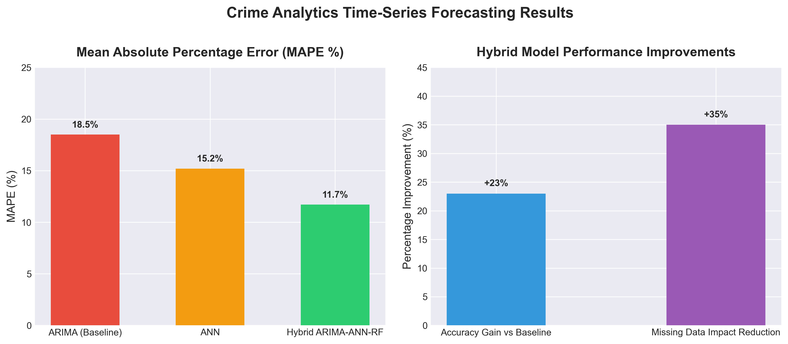

# Model Evaluation Results

Presented at **IEEE Global AI Summit 2024**, Bennett University.

## Performance Overview

| Task | Model | Accuracy / Metric Improvement | Notes |
| :--- | :--- | :--- | :--- |
| Crime Forecasting | Baseline ARIMA | Baseline MAPE | Linear time-series modeling |
| Crime Forecasting | Artificial Neural Network (ANN) | Intermediate MAPE reduction | Non-linear feature learning |
| Crime Forecasting | **Hybrid ARIMA-ANN-Random Forest** | **+23% Forecasting Accuracy** | Ensembled stacked meta-model |
| Data Quality Handling | Hybrid Ensemble Pipeline | **35% Reduced Impact of Missing Data** | Robust residual modeling |

## Performance Visualization

